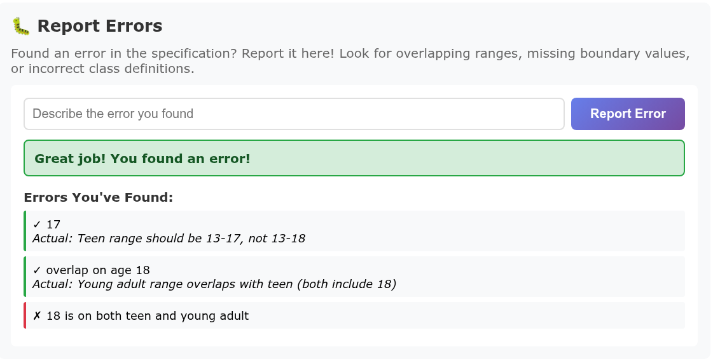
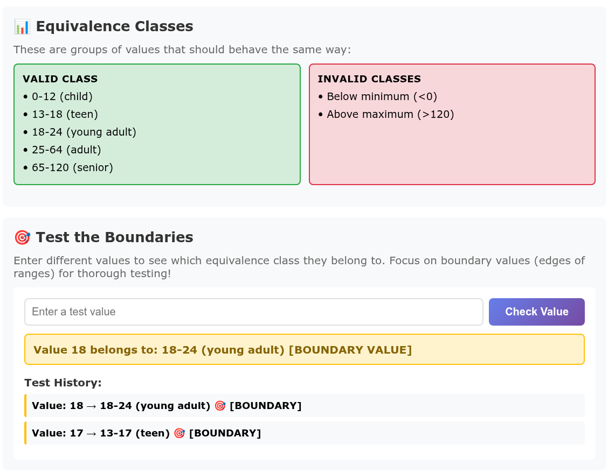

# AI Testing Vibe Coding

## Introduction
This assignment was to let AI create a game that introduced equivalence classes and boundary testing.

## Vibe Coding Assignment
First, I black boxed this, I let Claude do the entire project.

I asked Claude to whip this up for me, and was actually very dissapointed with the results. It made 4 categories, each with just one range. Age (0 - 120), Temperature (0°F - 100°F), Exam Scores (0 - 100), and Password length (18 - 36). I had it remove the Password length, and break each of the others up into better classes. Then I told it to introduce bugs into the system, and a list of found unique bugs. This gave me an interesting interface. It was an input box that took natural language, and when I wanted to guess at a bug I found, it would let me know if I was right or wrong. I was not to happy with the bugs it introduced: Class overlap in Age: 13 - 18 (teen) && 18 - 24 (young adult), and the range for teen should be 13 - 17. I suspect that being more specific on what types of errors I was expecting would have worked better.

## Conclusion
Problems I found: 

* I was too vague when asking Claude to make the game and the test cases, and it made very simple tests until I encouraged it to make better ones.
* It added a section that would reveal the solution & Key boundary values. That part of the interface worked for a bit, but later on stopped working without me prompting the AI to change it.

What did I learn:
* Be more specific when I have expectations.
* Make sure the AI doesn't wipe out code it previously fixed.

