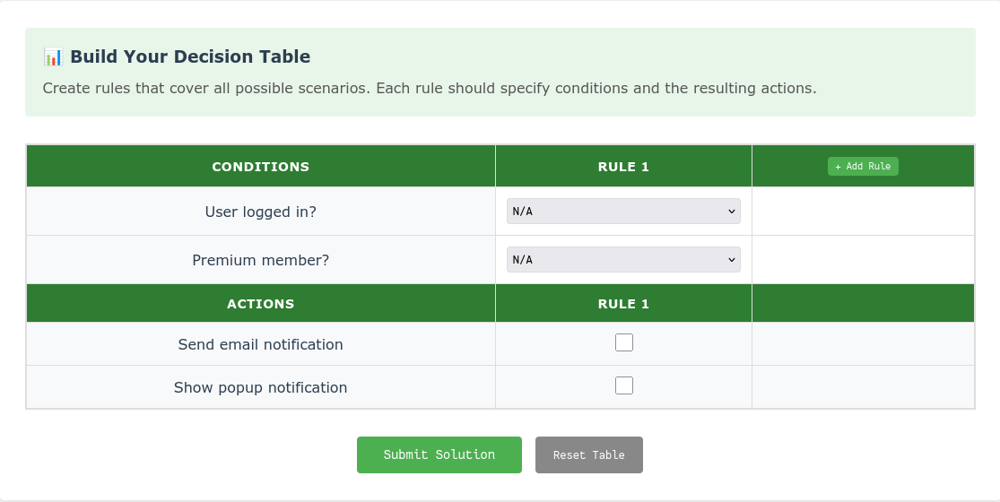
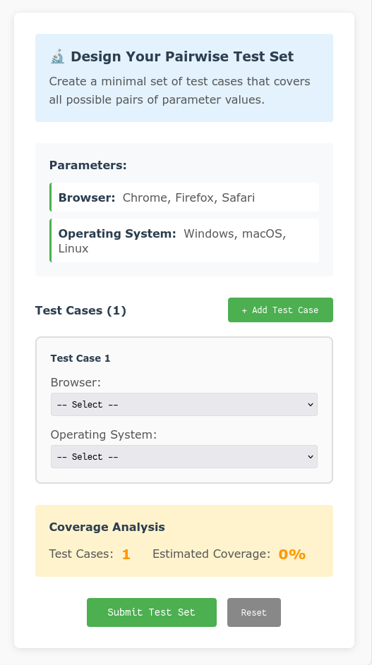
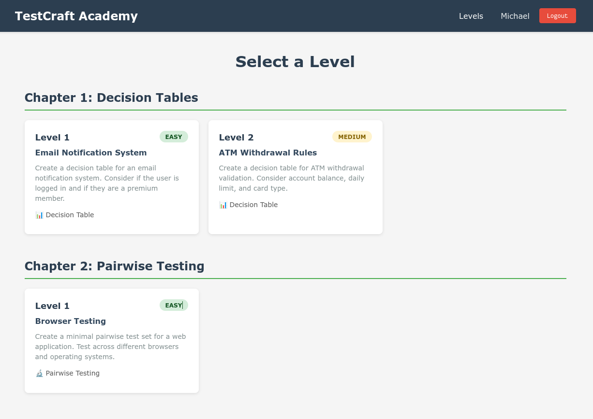
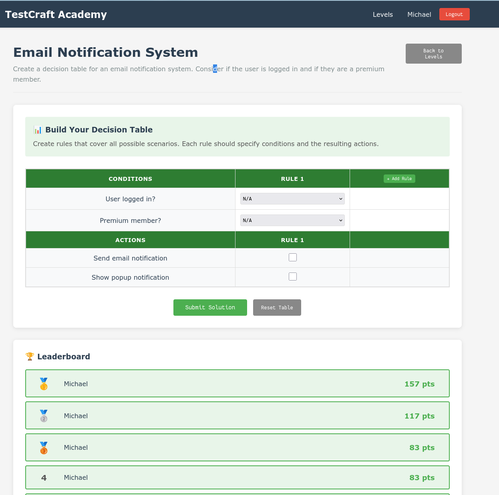
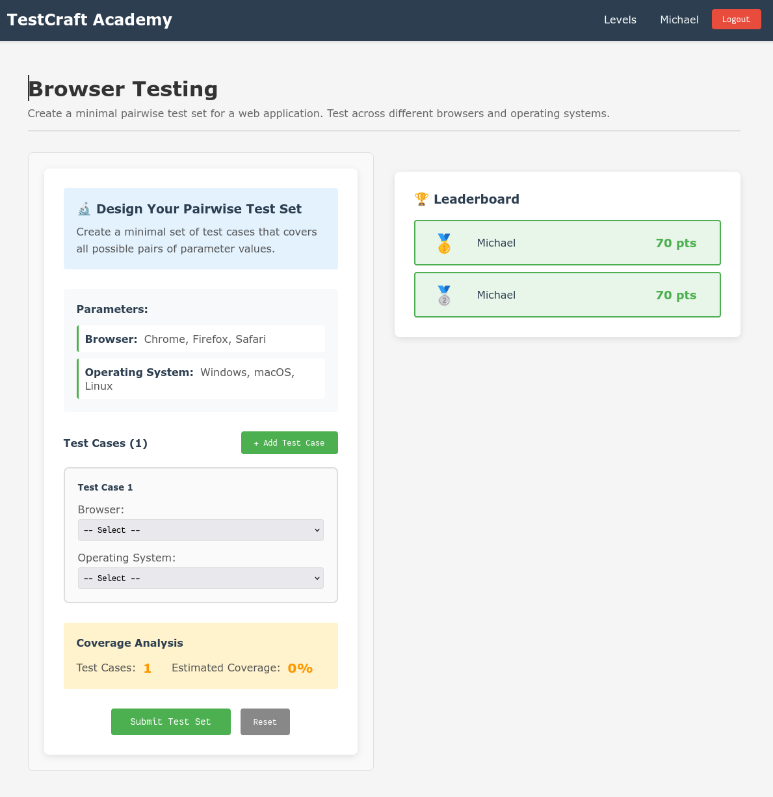
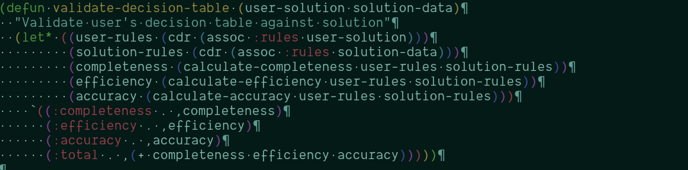
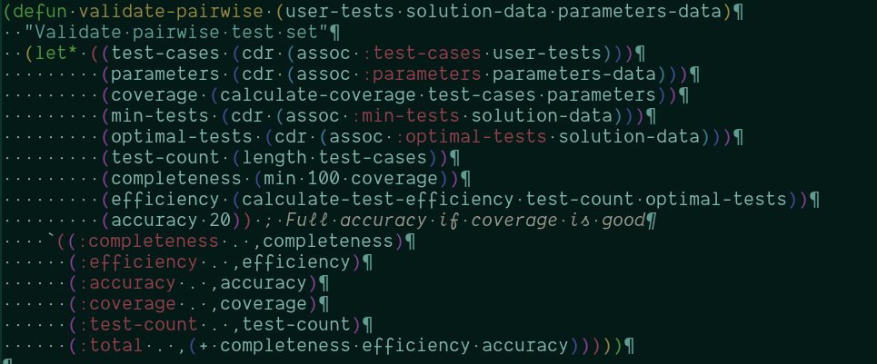
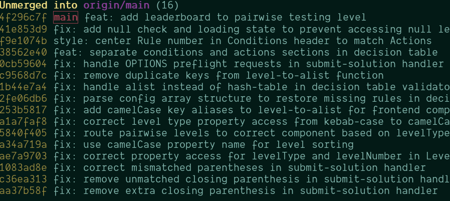

# Vibe Coding Mini Project 2

## Introduction

The objective was to have AI make a game to have the user test different instances of Pairwise testing and Decision Tables.

Decision Tables are a visual representation (usually tables) that show what actions when certain conditions are in effect.

An Example:

Pairwise Testing tests every possible combination.

## Vibe Coding Assignment

Using Claude (Sonnet) I had it create a teaching game "TestCraft Academy" that tests the user on how complete their tests are for Decision Tables, and Pairwise tests. It records the Test Sets, and lets the user know how complete they are.

The system has a server (written in common lisp) and a frontend written in vue.js it uses a SQLite3 database to store the users and scores.

## Conclusion

Although the final product works well, and looks decent, the amount of prompting I had to give Claude was very verbose, and I feel this is different from other no-code solutions. Claude knows I like using lisp for most backend and server systems, so it will default to those for the backend. For the frontend, it usually defaults to Vue.js because it knows I have experience in that as well. Problem is Claude really is not good at common lisp. No code solutions like replit keep to one or two programming languages depending on what they are creating, so they are better at them. I am sure if I was using a more commonly used language (C#, Java, node.js, &c.) it would be better at creating the client-server applications.

It works well designing the application, suggesting workflows, and architectures, but the actual coding and bug fixing was time consuming.

