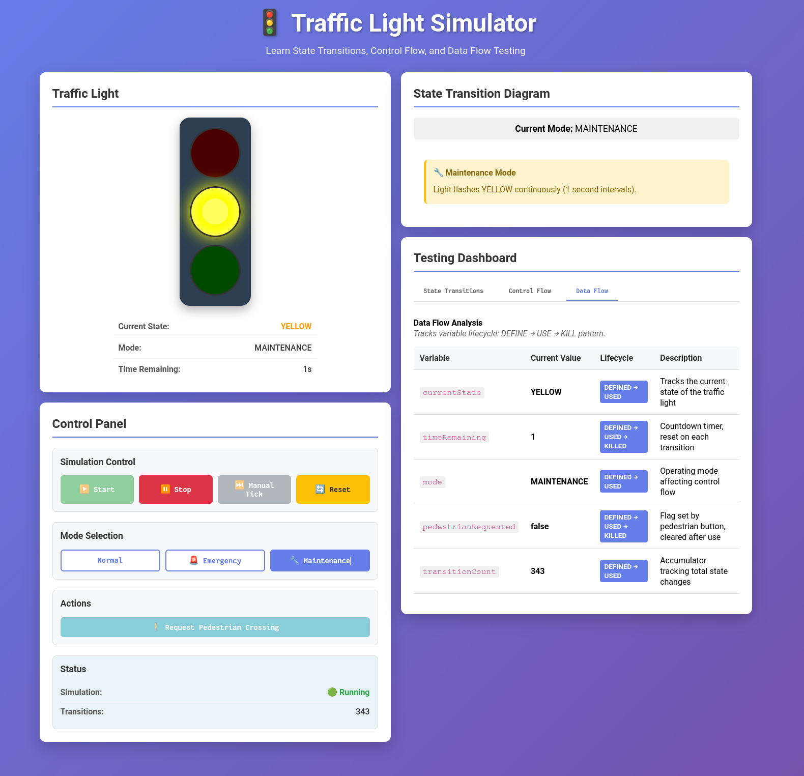

# Vibe Coding Mini Project 3

## Introduction

The objective was to have AI make a simulation to demonstrate state transitions, control flow testing, and data flow testing.

## Vibe Coding Assignment

Using Claude (Sonnet) within emacs (Aidermacs) in architect mode (I think it is called planning in other IDEs) I had it design the application with the specifications I wanted. Then I switched it into code mode, and had it create the program, and then I tested it. I told it to just use the most common languages and patterns for this application.

It created a client server application using Node.js for the server, and React for the front end.

## Conclusion

This worked extremely well. Claude created the entire application on the first try with very little adjustments needed. This proves my previous theory that Claude works better with languages and frameworks that are more commonly used in the field.

Claude included a Testing Dashboard that had the three required testing statuses: State Transitions, Control Flow, and Data Flow. 

The only problems I found were when a user changed the mode to Emergency or Maintenance, it didn't take into consideration the state before the mode was chosen.
