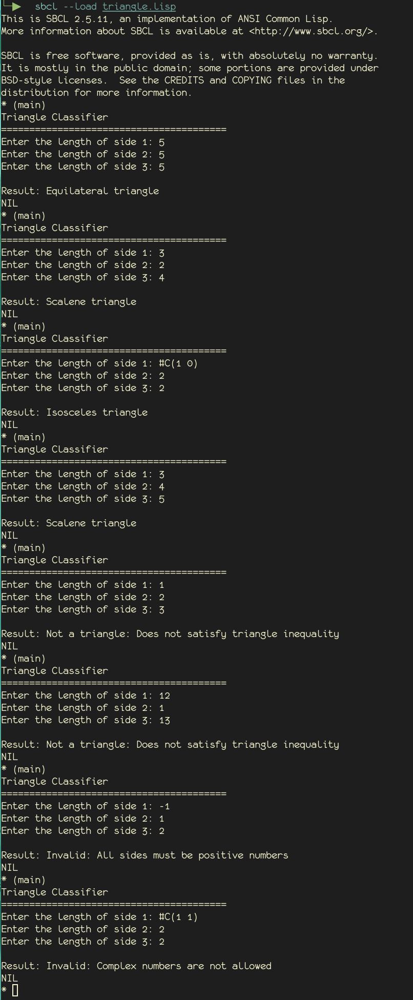
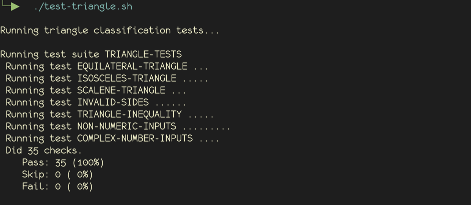

# Introduction
- This is the simple introductory program used in *The Art of Software Testing*, the triangle program. I wrote the program in common lisp.
- To write the program, I wrote down the expectations of the program and test file, then I asked Claude to create and update the files with my specifications.
- Errors were handled in the program by filtering out illegal inputs:
  - Check to make sure we are getting numeric inputs
  - Check to make sure all inputs are positive
  - Check to make sure the triangle passes a triangle inequality test:
    The sum of two of the sides must be less than or equal to the remaining side. [^1]
- Unit tests are run using the common lisp "FiveAM" testing framework https://github.com/lispci/fiveam
# Details of the program
- What IDE did you use? Emacs
- How did you get data into the program? Prompt user for input.
# Table with example test data:
The test data was created by Claude. I let it know what I expected it to test.

| Side 1   | Side 2   | Side 3  | Expected Result                          |
| -------- | -------- | ------- | ---------------------------------------- |
| 5        | 5        | 5       | Equilateral Triangle                     |
| 10       | 10       | 10      | Equilateral Triangle                     |
| 1.5      | 1.5      | 1.5     | Equilateral Triangle                     |
| 12       | 12       | 13      | Isosceles Triangle                       |
| 5        | 5        | 7       | Isosceles Triangle                       |
| 5        | 7        | 5       | Isosceles Triangle                       |
| 7        | 5        | 5       | Isosceles Triangle                       |
| #C(1, 0) | 5        | 5       | Isosceles Triangle                       |
| 3        | 4        | 5       | Scalene Triangle                         |
| 5        | 7        | 9       | Scalene Triangle                         |
| 2.5      | 3.5      | 4.5     | Scalene Triangle                         |
| 0        | 5        | 5       | Invalid Triangle (all sides must be > 0) |
| 5        | 0        | 5       | Invalid Triangle (all sides must be > 0) |
| 5        | 5        | 0       | Invalid Triangle (all sides must be > 0) |
| -1       | 5        | 5       | Invalid Triangle (all sides must be > 0) |
| 5        | -1       | 5       | Invalid Triangle (all sides must be > 0) |
| 5        | 5        | -1      | Invalid Triangle (all sides must be > 0) |
| 1        | 2        | 5       | Inputs fail triangle inequality test     |
| 1        | 5        | 2       | Inputs fail triangle inequality test     |
| 5        | 1        | 2       | Inputs fail triangle inequality test     |
| 1        | 2        | 3       | Inputs fail triangle inequality test     |
| 10       | 5        | 3       | Inputs fail triangle inequality test     |
| "abc"    | 5        | 5       | Input must be numeric                    |
| 5        | "xyz"    | 5       | Input must be numeric                    |
| 5        | 5        | "test"  | Input must be numeric                    |
| 'symbol  | 5        | 5       | Input must be numeric                    |
| 5        | 'another | 5       | Input must be numeric                    |
| 5        | 5        | 'third  | Input must be numeric                    |
| nil      | 5        | 5       | Input must be numeric                    |
| 5        | nil      | 5       | Input must be numeric                    |
| 5        | 5        | nil     | Input must be numeric                    |
| #C(1 1)  | 5        | 5       | Complex numbers are not allowed          |
| 5        | #C(2 3)  | 5       | Complex numbers are not allowed          |
| 5        | 5        | #C(4 5) | Complex numbers are not allowed          |
| #C(0 1)  | #C(0 1)  | 5       | Complex numbers are not allowed          |

# Unit Tests
Unit tests were created from the table above. I chose these because they gave coverage for the expected edge cases.
# Bugs found while testing
- The first bug was the possibility of entering non-numeric input
  Added a check to make sure the inputs were numbers
- The second bug found is the possibility of inputing complex numbers `#C(1 1)`
  Added check to make sure the input was not a complex number.
- Testing for complex numbers, and Claude added `#C(1 0)` as a complex number.
  Considering CL interpreters will reduce this to simply 1, it would be a valid input.
# What kind of problems did I encounter
- Probably from my configuration, but the agent plugin I am using defaults to the repository top, and project is build inside a directory of that repository, so I had to run the scripts outside of the agent (no need to run them inside it anyways).

# Run output

# Test output

# References
[^1]: Euclid. (c. 300 BC). *The Elements*. 
