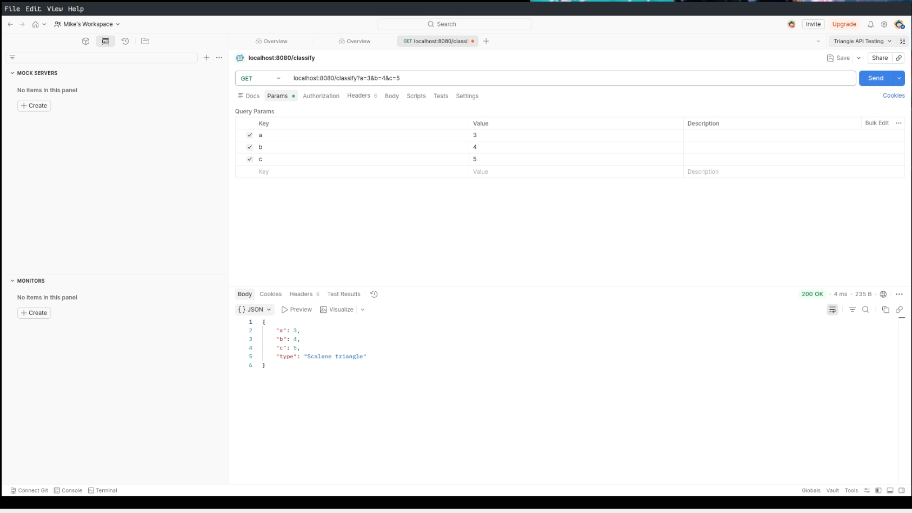
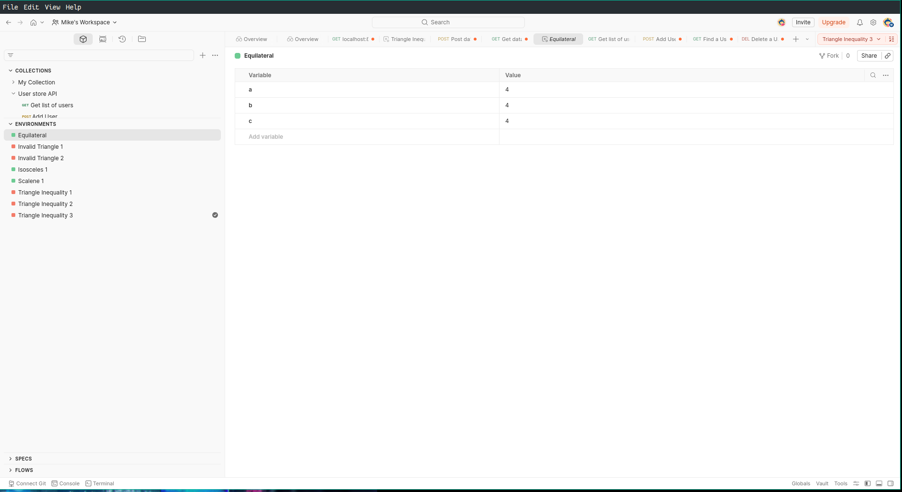
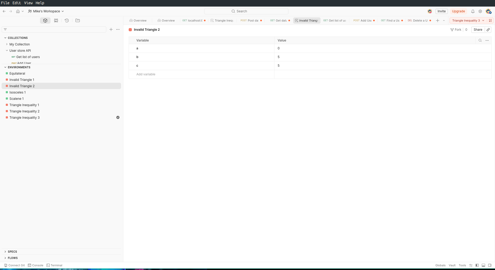
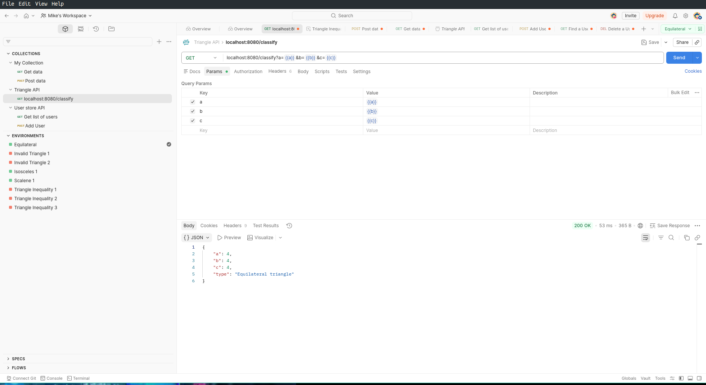
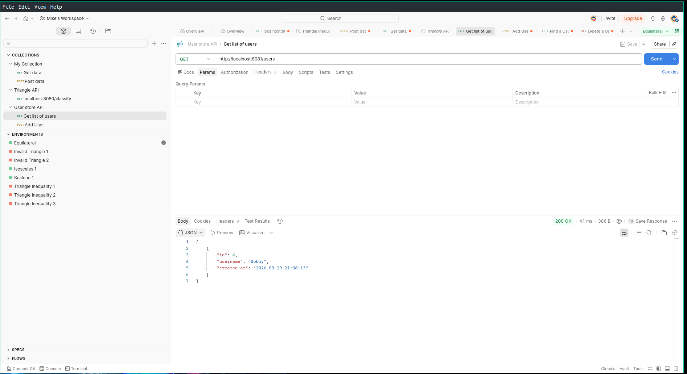
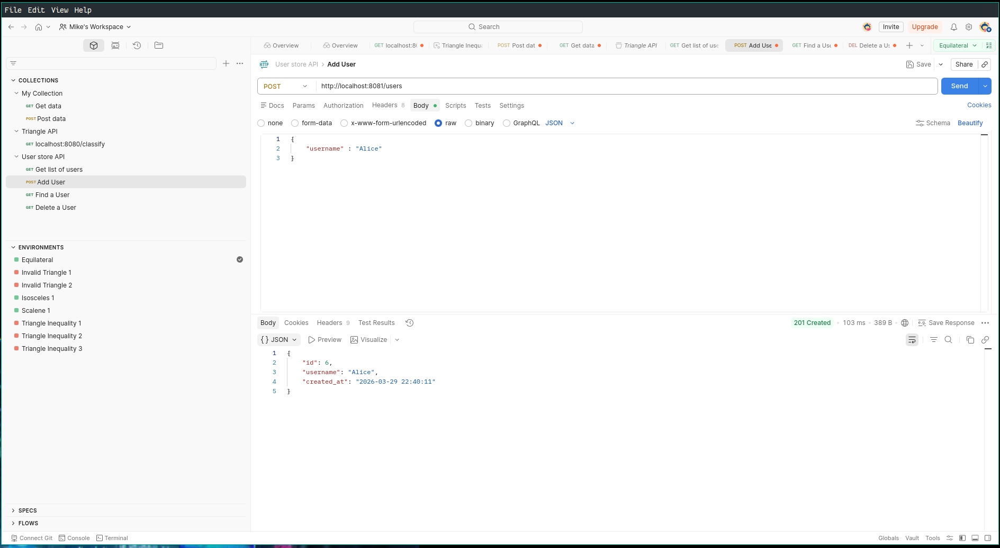
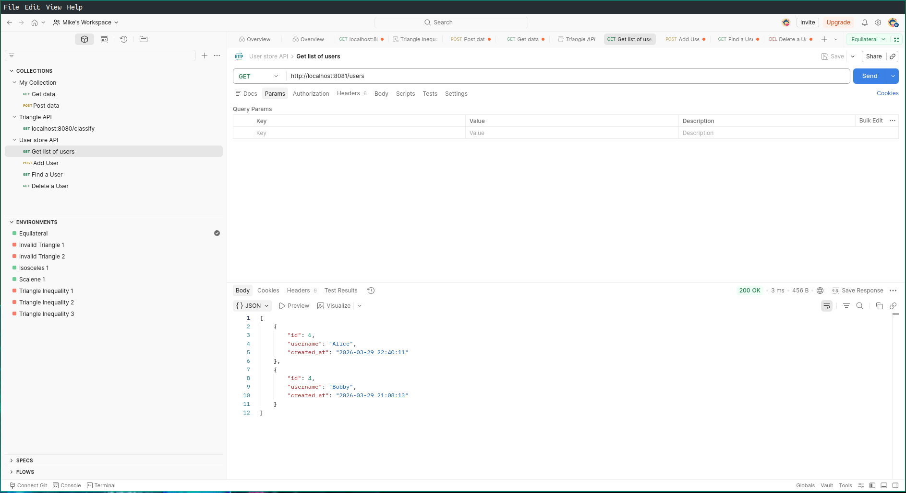

# Project 2: Integration Testing with Postman

## Introduction
Continuing the use of Common Lisp, I have created a server with an API that will return the state of a triangle with given inputs. The server only has one endpoint: /classify, and it takes 3 inputs: a, b, and c. for example:
``` shell
$ curl --get http://localhost:8080/classify?a=3&b=4&c=5.0
{"a": 3, "b": 4, "c": 5.0, "type": "Scalene triangle"}
```
I used Claude to write the server, and an HTML client.

Interestingly, it added a very simple interface at http://localhost:8080/ to request results.

## Part 1: API, Integration and testing with Postman
### Describe the basic functionality of HTTP.
HTTP (Hypertext Transfer Protocol) is the foundation of data communication on the web — a request/response protocol that defines how clients and servers talk to each other.

### Clients and Servers [^2]
The web runs on a client/server model. A client is anything that initiates a request — typically a browser, but also command-line tools like curl, mobile apps, or services calling other services. A server is a program (running on a machine somewhere) that listens for incoming requests and sends back responses. The client always speaks first; the server only responds. Some applications will combine these two, but the web will still consider them two different applications.

### Requests and Responses [^2]
Every HTTP interaction follows the same pattern: the client sends a request, the server processes it, and the server sends back a response.
A request has three main parts:

* A request line — the verb, the path, and the HTTP version (e.g., `GET /index.html HTTP/1.1`)
* Headers — metadata about the request
* Optionally, a body — data being sent to the server

A response mirrors this structure:

* A status line — the HTTP version and a status code (e.g., `HTTP/1.1 200 OK`)
* Headers — metadata about the response
* Optionally, a body — the content being returned

### Headers vs. Body [^2]
Headers are key/value pairs that carry metadata — information about the message itself, not the content. Examples include:

| Header           | Example              | Purpose                                     |
|------------------|----------------------|---------------------------------------------|
| `Content-Type`   | `application/json`   | Describes the format of the body            |
| `Authorization`  | `Bearer abc123Sends` | credentials                                 |
| `Accept`         | `text/html`          | Tells the server what the client can handle |
| `Content-Length` | `348`                | Size of the body in bytes                   |

The body carries the actual payload — an HTML page, a JSON object, an uploaded file, etc. Not all requests have a body; GET requests typically don't.

### Status Codes [^2]
Status codes are three-digit numbers in the response that tell the client what happened. They're grouped by their first digit:

| Range | Category      | Common Examples                                                         |
|-------|---------------|-------------------------------------------------------------------------|
| `1xx` | Informational | `100 Continue`                                                          |
| `2xx` | Success       | `200 OK`, `201 Created`, `204 No Content`                               |
| `3xx` | Redirection   | `301 Moved Permanently`, `302 Found`                                    |
| `4xx` | Client Error  | `400 Bad Request`, `401 Unauthorized`, `403 Forbidden`, `404 Not Found` |
| `5xx` | Server Error  | `500 Internal Server Error`, `503 Service Unavailable`                  |

Status codes are a convention, not a law — nothing enforces that a server returns the semantically correct one. For example, Oracle EBS is known to use this pattern. The server will return a `404` instead of `401` or `403` as a deliberate security practice. This is intended to avoid leaking information about whether a resource exists (a would-be attacker learns less if you just say "not found" rather than "unauthorized"). This is called security through obscurity.

### HTTP Verbs (Methods) [^1]
HTTP verbs define the intent of the request. The four you'll use most:

| Verb      | Intent                       | Has Body? | Idempotent? |
|-----------|------------------------------|-----------|-------------|
| `GET`     | Retrieve a resource          | No        | Yes         |
| `POST`    | Create a new resource        | Yes       | No          |
| `PUT`     | Replace a resource entirely  | Yes       | Yes         |
| `DELETE`  | Remove a resource            | Sometimes | Yes         |
| `HEAD`    | Get without body             | No        | Yes         |
| `CONNECT` | Establish a tunnel           | No        | No          |
| `OPTIONS` | Communication Options        | Yes       | Yes         |
| `TRACE`   | Message loopback test        | No        | Yes         |
| `PATCH`   | Applies partial modifactions | Yes       | No          |

Idempotent means you can send the same request multiple times and get the same result — `DELETE /user/5` ten times has the same end state as once (the user is gone). `POST /users` ten times creates ten users, so it's not idempotent.

### HTTP is Stateless [^2]
With HTTP, every request is completely independent. The server has no memory of previous requests. When you send request #47, the server has no idea that you also sent requests #1 through #46.

Every request must carry all the context the server needs to fulfill it (credentials, session info, etc.)
The server doesn't keep open a "conversation" with the client between requests
Scalability is easier — any server in a cluster can handle any request, because no server holds your session state

The practical implication is that mechanisms like cookies, tokens (JWT), and session IDs exist specifically to work around statelessness — they're ways of re-attaching context to each new request so the application can behave as if it remembers you, even though the protocol itself does not.
This is like a help desk where every time you communicate with a new person, you have to re-submit all your information, and re-explain the entire problem.

### Describe the roles of APIs in modern applications
**What is an API?** [^4]

An API (Application Programming Interface) is a defined contract that specifies how software components talk to each other. In the web context, an API is the layer a server exposes so that clients — whether browsers, mobile apps, or other services — can request data or trigger actions without needing to know anything about the server's internal implementation.

APIs are what make modern applications composable. Rather than every application building everything from scratch, they consume and expose APIs to share functionality. Your weather app doesn't run its own weather satellites — it calls a weather API. Your e-commerce checkout doesn't build its own payment system — it calls Stripe's API.

In this sense, APIs are the connective tissue of the modern web.

**Open APIs** [^4]

An Open API (also called a public API) is an API that is documented and made available for external developers to use — sometimes freely, sometimes under a key/quota system, sometimes commercially licensed. "Open" refers to accessibility, not necessarily open-source licensing.

**Why Open APIs Matter** [^4]

For developers, Open APIs eliminate the need to rebuild solved problems. Authentication, mapping, payments, messaging, machine translation — all of these exist as mature APIs that can be integrated in hours rather than built over months.

For businesses, exposing an Open API turns a product into a platform. When third parties can build on top of your API, your reach extends far beyond what your own team could build. This is how ecosystems form.

For the broader web, Open APIs enable interoperability — systems from different vendors can exchange data without custom integration work for every pair of systems.

**One Example**

OpenWeatherMap API[^3] - Provides weather data to developers for use in their own applications.

API Call:
``` shell
API_KEY=<get an API Key, and put it here>
curl --get https://api.openweathermap.org/data/2.5/weather?q=Minneapolis&appid={$API_KEY}
```
OpenWeatherMap has over 3 million applications that use it's API. These applications are in logistics, energy, travel, insurance, and agriculture.

### Describe Cross-Origin Resource Sharing (CORS) [^5]
It is a way for a server to tell a browser that it should permit certain loading resources. With a CORS defined for a server, a fetch() call can call resources outside the domain, if they are in the CORS header. For example, Server (in domain-a) defines domain-b in it's CORS. A fetch statemtent request resources from domain-a and domain-b will be allowed, but any others (say we tried to fetch from domain-c) would fail with a CORS error.
This allows outside resources to be used, if explicitly defined in the CORS header.

### Describe how API's are secured and what you need to do to access a secure API.
There are multiple ways to access a secure API. The most common would be with an API key, which is normally a public SSH key created by the API for a client to use; Github, Claude API, and Gemini API all use the SSH key method.
To access these apis, the key has to be sent to the server api, for instance with the OpenWeatherMap API shown earlier:

``` shell
API_KEY=<get an API Key, and put it here>
curl --get https://api.openweathermap.org/data/2.5/weather?q=Minneapolis&appid={$API_KEY}
```
The API key needs to be obtained from the API provider so the api can be used.

### List 5 Public Open APIs that you can use to get data.
* GitHub - [https://docs.github.com/en/rest/quickstart?apiVersion=2026-03-10](https://docs.github.com/en/rest/quickstart?apiVersion=2026-03-10)
* GitLab - [https://docs.gitlab.com/api/rest/](https://docs.gitlab.com/api/rest/)
* Claude Platform - [https://platform.claude.com/docs/en/home](https://platform.claude.com/docs/en/home)
* Kaggle - [https://www.kaggle.com/docs/api](https://www.kaggle.com/docs/api)
* Dropbox - [https://www.dropbox.com/developers/documentation/http/documentation](https://www.dropbox.com/developers/documentation/http/documentation)
* OpenWeatherMap (Previously Mentioned) - [https://www.openweathermap.org/api](https://www.openweathermap.org/api)

## Part 2: Postman Demonstration
The triangle server I created only has one endpoint: `/classify` that takes 3 inputs: `a`, `b`, and `c`.
I understand that i  t was recommended to use Flask/Python for this, but I still used Common Lisp with Hunchentoot for the server.

Demonstration Video:

1. Show API being used with HTML client
2. Show API being used with curl
3. Show API being used with Postman
  - Created Collection
  - Did multiple get requests
[]()
  - Created an Environment for collection
  - Refactored the variables to use the environment variables.
  - Showed 8 Different Environments (Just different side lengths) I understand this can be used for much more advanced ideas like different environments (dev/test/prod) and other situations.
[]()
[]()
[]()
  - My triangle API does not include any POST endpoints, so had claude create a simple USER DB API that stores names.
  - From user store: pulled list of names
[]()
  - Added new name
[]()
  - pulled new list of names.
[]()

## The Extra Credit Part
I did not see a way to automate Postman, but considering how widely used it is, I am sure it is available with the CLI, or other methods.

### Benefits of using curl?

- Curl is widely used, and very stable. It was originally released in 1996.
- Curl is standard on modern UNIX type systems (Linux, MacOS), so no additional software is needed to use it.
- Curl can be easily used in a bash script
- Curl has a library available — `libcurl` — where the curl commands can be implemented in different programming languages (C, C++, python, lisp, java, &c.)
- You do not have to sign up to use curl.

# References

[^1]: Mozilla Developer Network. (2026). *HTTPS Request Methods*. Mozilla Developer Network. [https://developer.mozilla.org/en-US/docs/Web/HTTP/Reference/Methods](https://developer.mozilla.org/en-US/docs/Web/HTTP/Reference/Methods)
[^2]: Stevens, W. R. (1994). *TCP/IP Illustrated, Volume 1*. Addison Wesley.
[^3]: OpenWeatherMap. (2026). *Build with Weather Data*. OpenWeatherMap. [https://www.openweathermap.org](https://www.openweathermap.org)
[^4]: McKenzie, C. (2021). *What is Open API (public API)?*. TechTarget. [https://www.techtarget.com/searchapparchitecture/definition/open-API-public-API](https://www.techtarget.com/searchapparchitecture/definition/open-API-public-API)
[^5]: Mozilla Developer Network. (2026). *Cross-Origin Resource Sharing (CORS)*. Mozilla Developer Network. [https://developer.mozilla.org/en-US/docs/Web/HTTP/Guides/CORS](https://developer.mozilla.org/en-US/docs/Web/HTTP/Guides/CORS)
