# Project 3: Performance Testing

## Introduction
This project was to get me familiar with using Apache JMeter, and learn about Performance testing. The web application I used was the user server I created for Project 2. It had the `GET` and `POST` commands that I could use to test on JMeter.

## Part 1

### Describe three types of performance tests and include graphs (3) for each test that plots "Time" on the X axis and "Number of threads" on the Y axis.

1. Load Testing - A type of performance testing that evaluates how a system behaves under expected — and sometimes extreme — levels of concurrent usage.
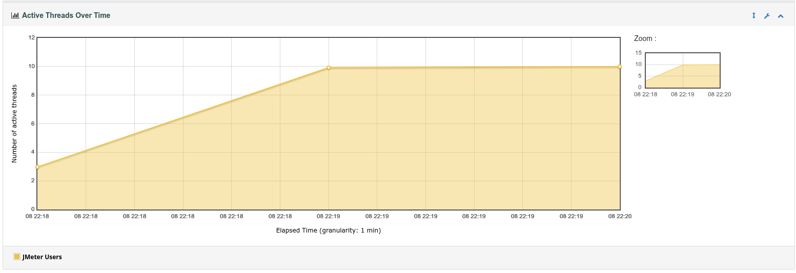

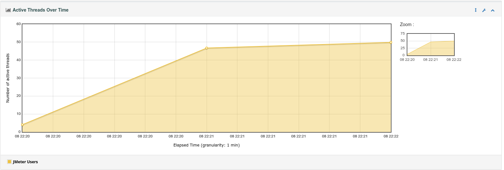

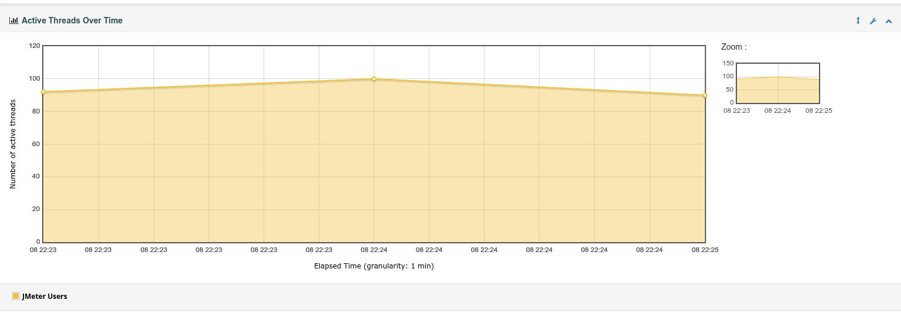

2. Endurance Testing - A continual form of load testing that is designed to expose memory leaks, resource exhaustion, or any other form of degradation the application will have over time.

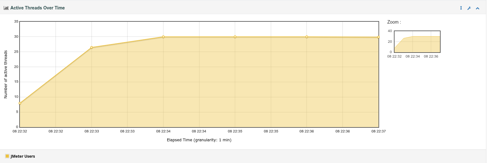

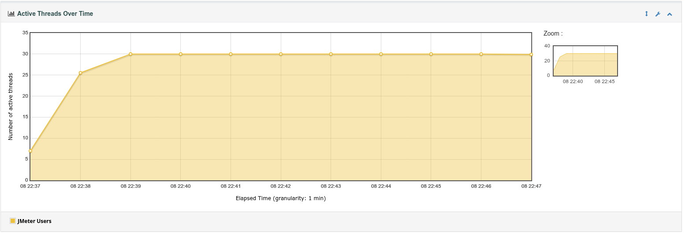

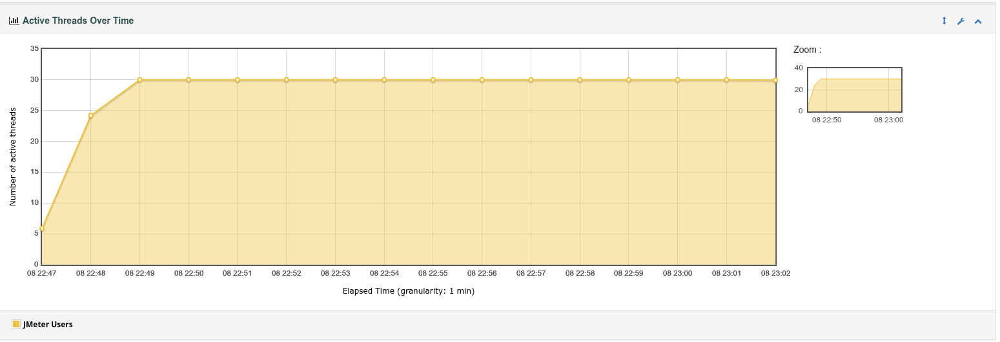

3. Stress / Spike Testing - Tests the system for sudden, dramatic changes to see how the system will respond to sharp traffic bursts.

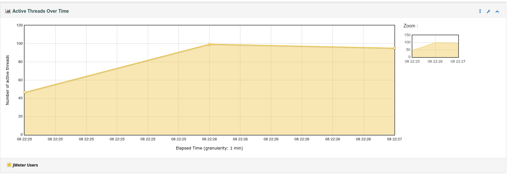

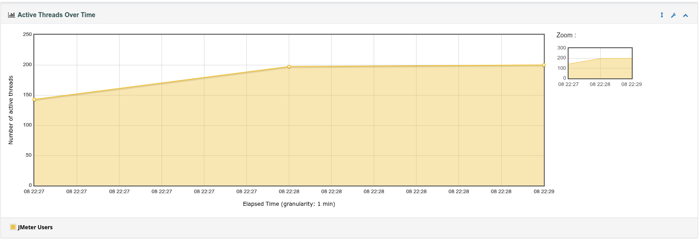

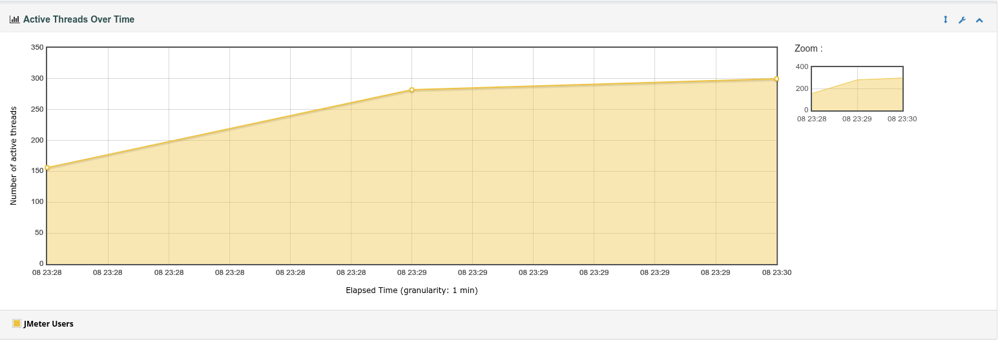

### Describe Parts of JMeter:

1. Thread Groups - A thread group is a group of threads. In the instructions, these were used to simulate users. Using the JMeter tool, one could adjust how many users (threads) were going to be running, their ramp-up period (time between separate threads starting), and a loop count (how many times you want it to run through the process). You can also customize each of them for different circumstances.

2. A HTTP request sampler - This is where you put the different HTTP requests the users (threads) are going to do. GET / POST / etc.

3. Config Elements - With these you can configure different elements of the testing. The tutorial had me add a default server name for the HTTPs requests the users (threads) will be using.

4. Listeners - These show the results of the samples.

### Describe an "Application Performance Index"

Abbreviated as Apdex, An `Application Performance Index` is a standarized, open specification for measuring and reporting end-user satisfaction with the response time of software applications. Apdex keeps the score between 0 (total dissatisfaction) and 1 (perfect satisfaction) making it easier to interpret what the score means. Compared to raw latency scores, or other metrics which are hard to read, and change depending on the system or network the application is running on.

## Part 2

### Perform the following in JMeter

1. Create a Thread Group for an Endurance Test. Name it appropriately.

2. Create a HTTP Request Sampler.

3. Create a `GET` request.

4. In the Thread Group, select "Config Elements" > "HTTP Header Manager." Add appropriate header data.

5. Access Thread Group > "Listeners" > "View Results Tree."

### Repeat for a different kind of test

1. Repeat the steps above for a different kind of test, e.g. Load, Stress, etc.

### I did not follow that exactly. I set this up:

Thread Group ->                     JMeter Users

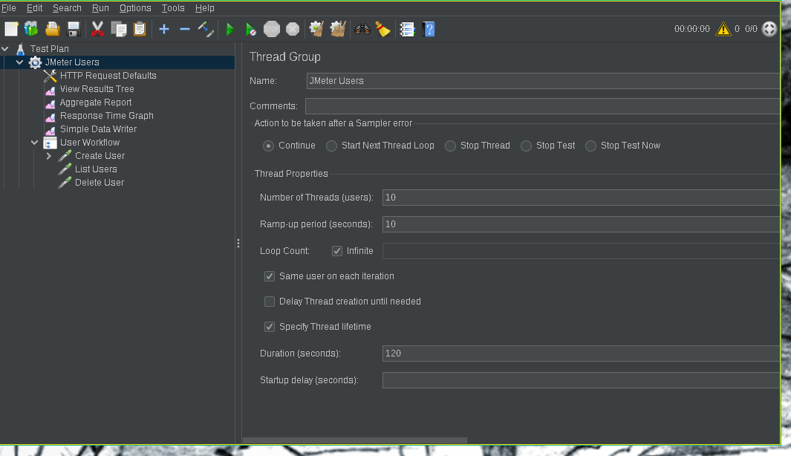

Config Elements ->                  | HTTP Request Defaults - with the API URL set in it.

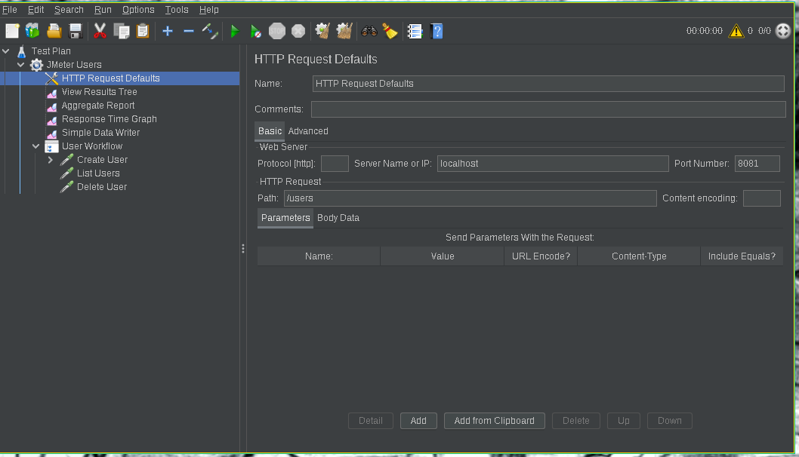

Listeners ->                        | View Results Tree

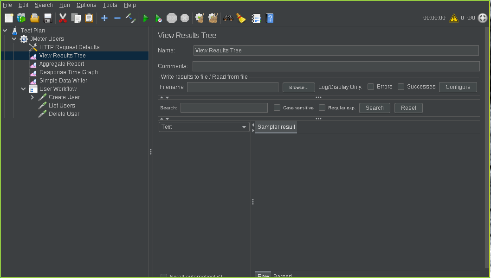

Listeners ->                        | Aggregate Report

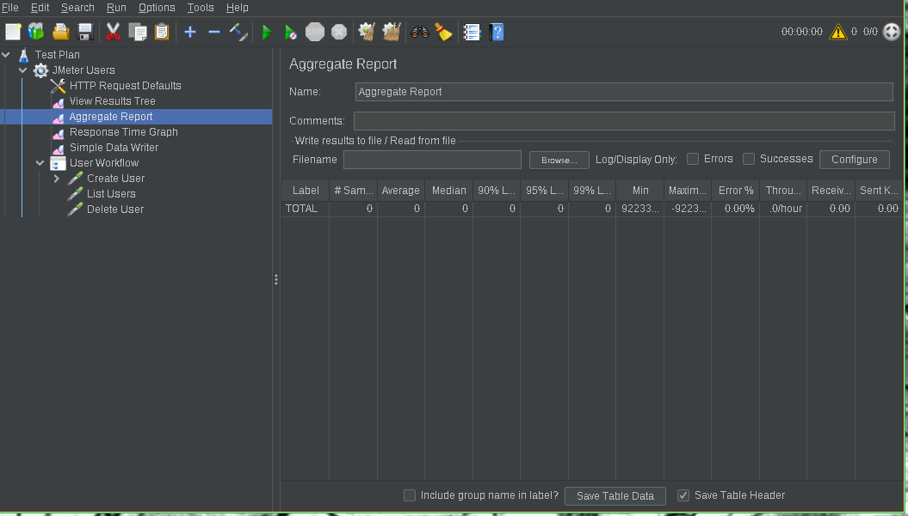

Listeners ->                        | Response Time Graph

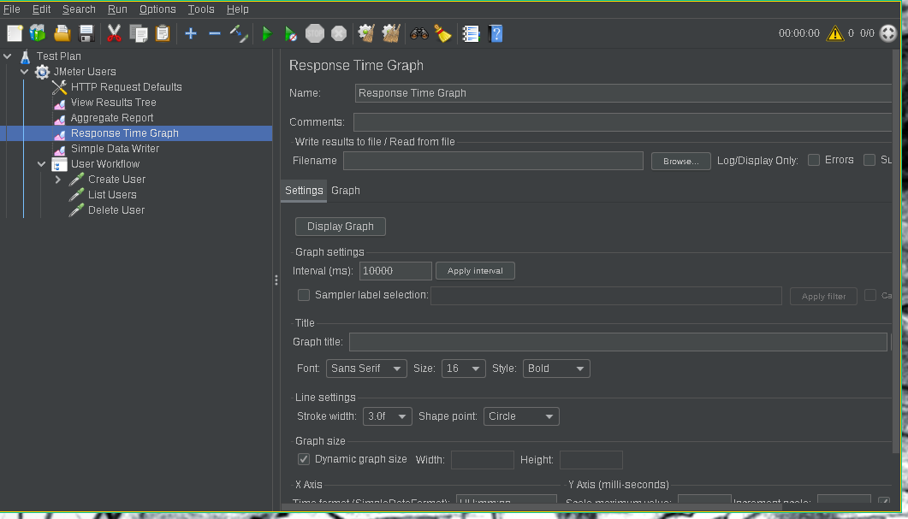

Listeners ->                        | Simple Data Writer

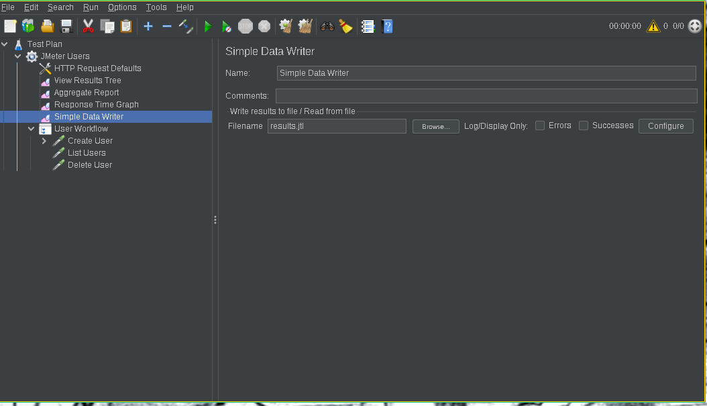

Workflow ->                         + User Workflow

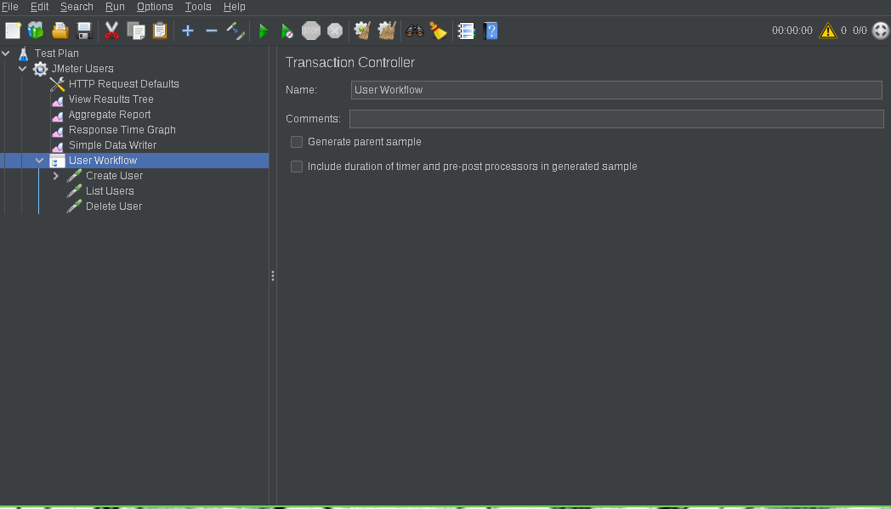

HTTP Request Sampler (POST)           | Create User

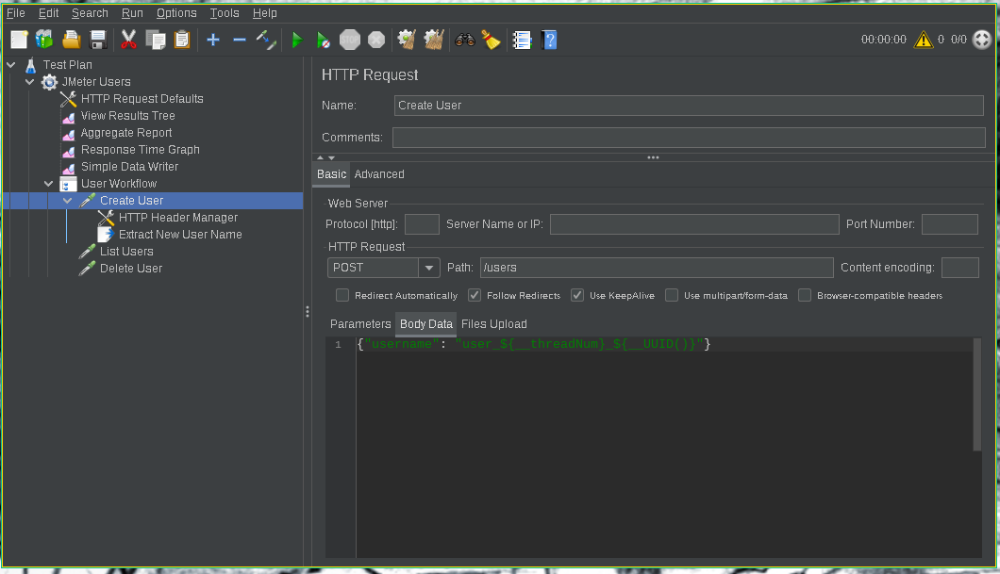

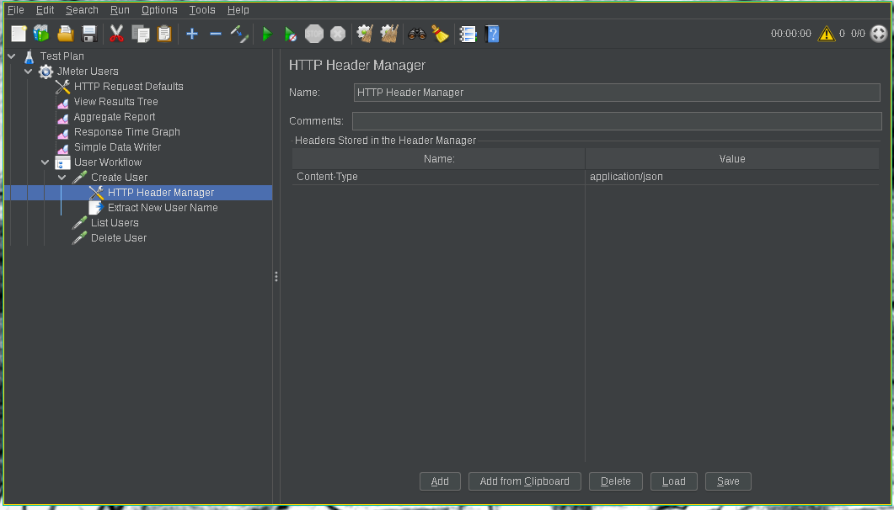

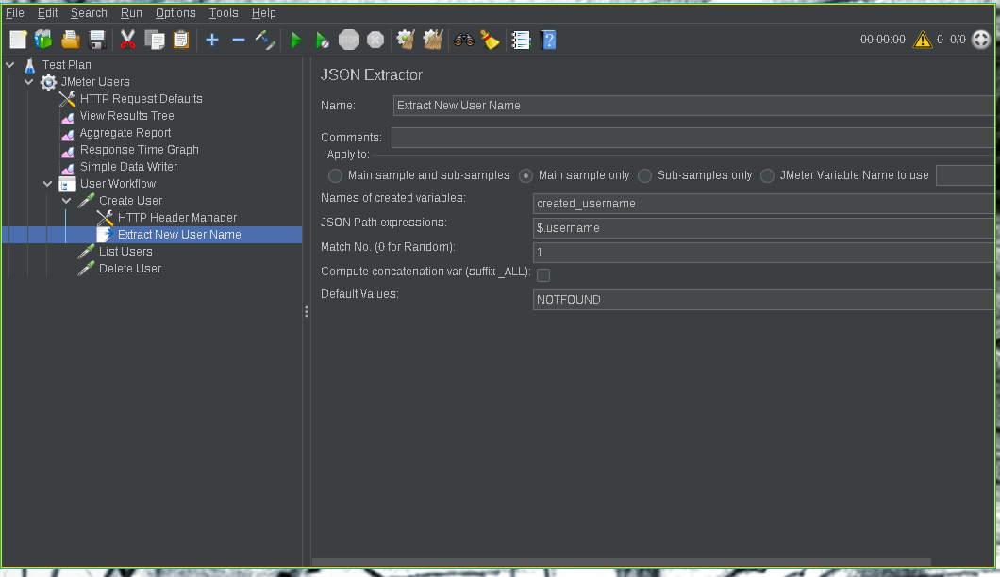

HTTP Request Sampler (GET)            | List User

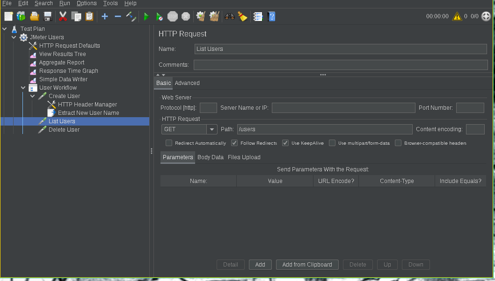

HTTP Request Sampler (DELETE)         | Delete User

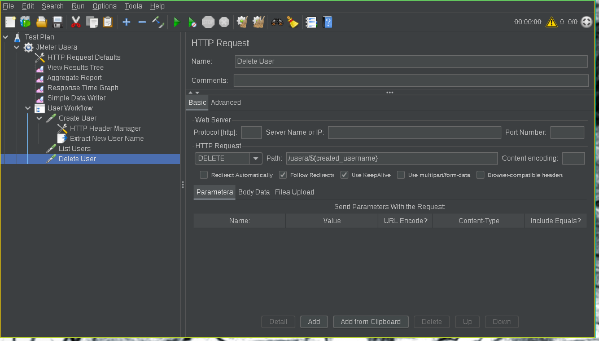

And ran 3 different tests depending on what I was working on testing.

- 3 load test (5, 50, 100) concurrent users with 10 seconds ramp-up. I did no loop count, I set it to infinite, and then used the thread lifetime of 120 seconds.
- 3 stress tests (100, 200, 300) concurrent users with the rest of the settings the same as the load tests.

- 3 endurance tests 30 concurrent users. One for 5 minutes, one for 10 minutes, and one for 15 minutes.

set these all up in a bash script, and let it run.:
``` shell
#!/bin/bash
set -e

echo Cleaning old runs
rm -rf report_load_10 report_load_50 report_load_100 *.jtl

echo Running tests

jmeter -n -t ./JMeter-Users-Load-10.jmx -l results-load-10.jtl -e -o ./report_load_10/
jmeter -n -t ./JMeter-Users-Load-50.jmx -l results-load-50.jtl -e -o ./report_load_50/ 
jmeter -n -t ./JMeter-Users-Load-100.jmx -l results-load-100.jtl -e -o ./report_load_100/
jmeter -n -t ./JMeter-Users-Stress-100.jmx -l results-stress-100.jtl -e -o ./report_stress-100/
jmeter -n -t ./JMeter-Users-Stress-200.jmx -l results-stress-200.jtl -e -o ./report_stress-200/
jmeter -n -t ./JMeter-Users-Stress-300.jmx -l results-stress-300.jtl -e -o ./report_stress-300/
jmeter -n -t ./JMeter-Users-Endurance-5m.jmx -l results-endurance-5m.jtl -e -o ./report_endurance-5m/
jmeter -n -t ./JMeter-Users-Endurance-10m.jmx -l results-endurance-10m.jtl -e -o ./report_endurance-10m/
jmeter -n -t ./JMeter-Users-Endurance-15m.jmx -l results-endurance-15m.jtl -e -o ./report_endurance-15m/

echo Finished tests
```
When finished, I just opened the reports
```
brave ./report_load_10/index.html
```
Opened the time vs threads graphs, took screenshots, and linked them to here.

## Extra Credit

* What Linux commands can be used to test and evaluate performance on a Virtual Machine or Server.

Linux has a ton of commands that can be used to see what is going on with the system. For Load Testing on a server, `top` (or my favorite, `htop`) can monitor CPU usage, `vmstat` or `pmap` can be used to monitor memory of a process. `iostat` or `iotop` will monitor physical storage activity. For networks, the most common would be to use `netstat`, or if you wanted simpler tools `ping`, `traceroute`, and `whois`. To actually test a system, there have been applications created to do just that such as `stress-ng` that will deliberately saturate the CPU, memory or I/O of the machine (virtual or not) it is running on to test to see how the system runs under a load.

## Conclusion
This worked really well for me testing the quick user database API that Claude built for me in project2. This revealed obvious bugs that were mostly architecture problems: Creating a new connection to the database on every read or write, having the server setup to only have a few connections at a time instead of a new server thread per connection...

I did learn how to use JMeter from this assignment.

## Suggestions for improvement:
Slight redesign, instead of a new vibe program every project, have everyone or group start one project, and have them build on that project (like a real project does) And while they are building that, have them apply the tests to it. I will help them feel like they built something while learning about how to test things.
